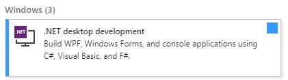
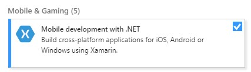
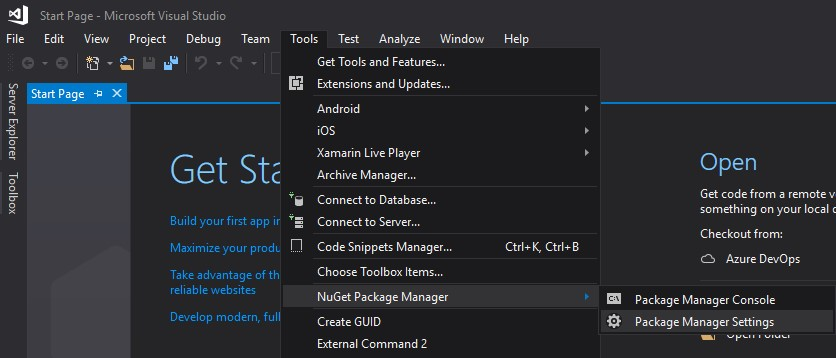
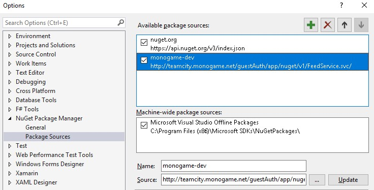
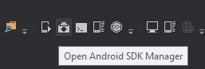
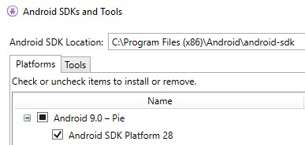
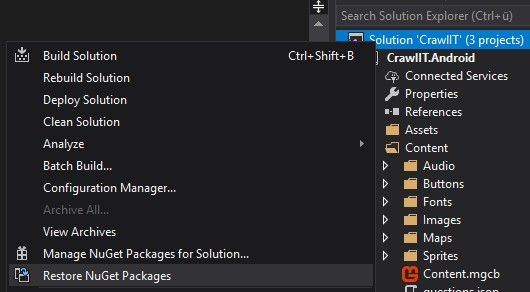
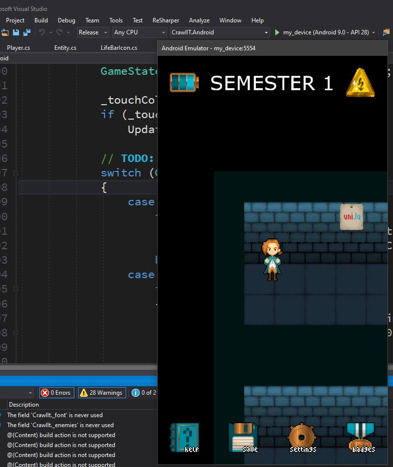

# Crawl IT

A promotional game for BINFO @ [uni.lu](https://binfo.uni.lu) made for the Software Engineering Project course.

## Downloading the current version

We've uploaded the latest version to the Google Play Store as a beta test, you can download for any Android phone here: <https://play.google.com/store/apps/details?id=com.crawl.it>

## Running the game in Visual Studio

The following was tested on a Windows 10 VM using Hyper-V (provided [here](https://developer.microsoft.com/en-us/microsoft-edge/tools/vms/)).

### Steps

- [Visual Studio 2017](https://my.visualstudio.com/Downloads?q=visual%20studio%202017&wt.mc_id=o~msft~vscom~older-downloads)
  - In the installer select
    - '.NET desktop development'  
    
    - 'Mobile development with .NET'  
    
- Adding the MonoGame dev NuGet package to VS:  
  
  
Source to use for the package: <http://teamcity.monogame.net/guestAuth/app/nuget/v1/FeedService.svc/>
- Install [MonoGame for Visual Studio](http://www.monogame.net/downloads), under the Development Builds section
- Clone this repo
- Open CrawlIT/CrawlIT.sln with Visual Studio
- Open Android SDK Manager (the highlighted icon)  

- Select Android 28 SDK like so:  

- Apply these changes and any outstanding updates (4 updates for me)
- In case of missing references, restore NuGet packages:  

- On my VM I also had to install the following redistributables (found [here](https://my.visualstudio.com/Downloads?q=redistributable&pgroup=)) to fix the errors that mention 'Importer XXX had an unexpected failure' in the output window:
  - Visual C++ for Visual Studio 2013
  - Visual C++ for Visual Studio 2012 Update 4
- Another note: on my VM downloading the project as a .zip caused the resulting folder to be read-only, which caused an issue with the MonoGame framework. Downloading the project through the Gitlab extension offered in Visual Studio solved this issue and finally allowed the build to succeed!
- From here the game should run once you press on the run button, which has a default android emulator installed.
- Extra note: the process on Mac should be similar (Pedro worked on the game exclusively on Mac, and he faced similar issues as mine). I think for next time we'll try using Unity, or focus on just building for one platform initially :)

### Result (hopefully)

